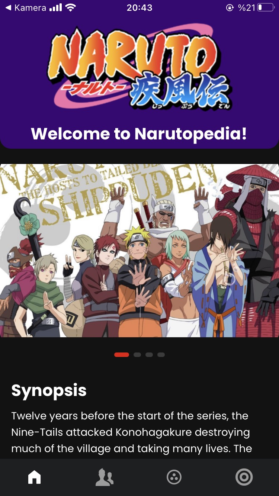
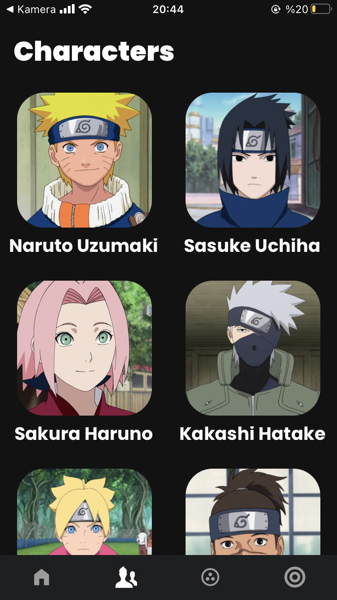
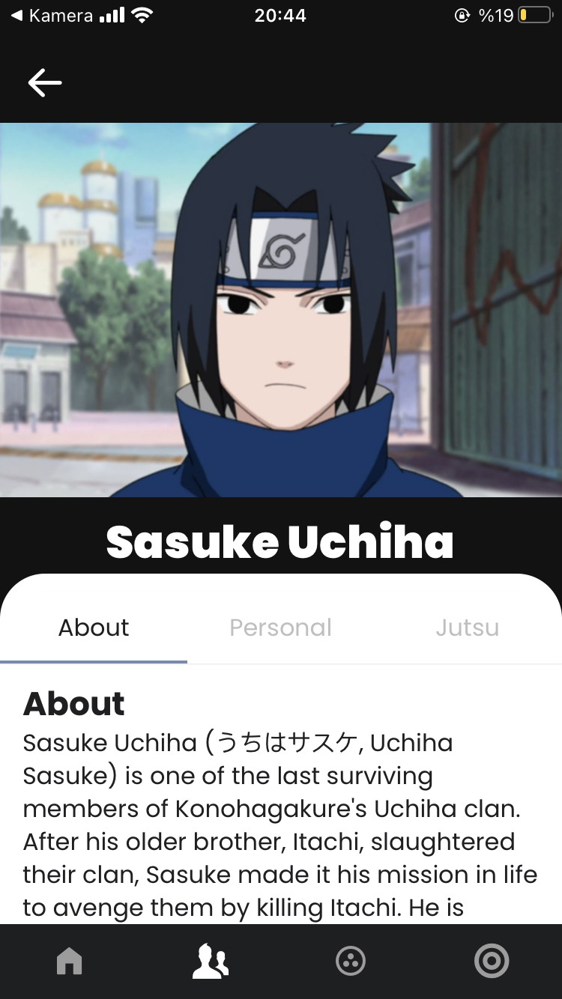
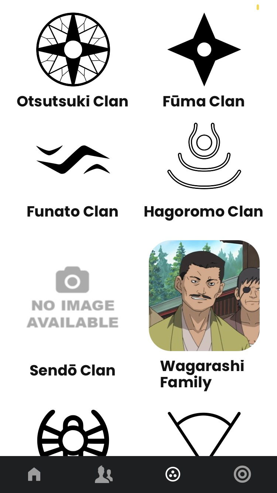
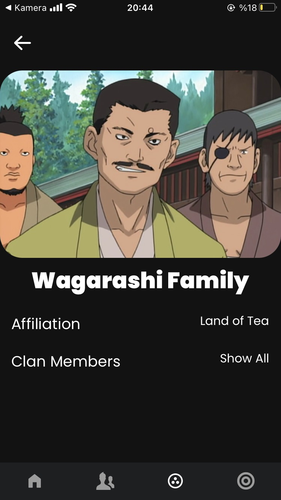
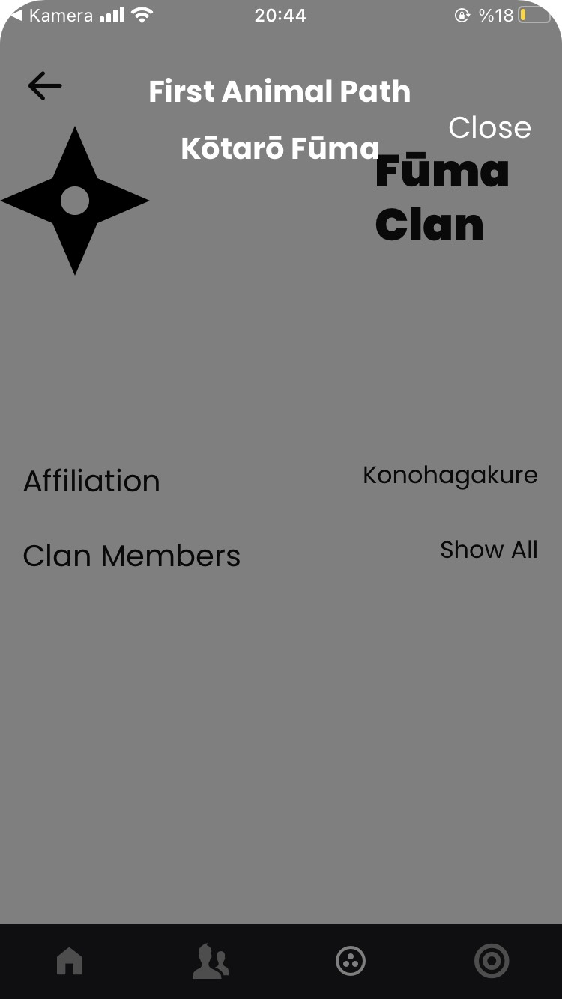
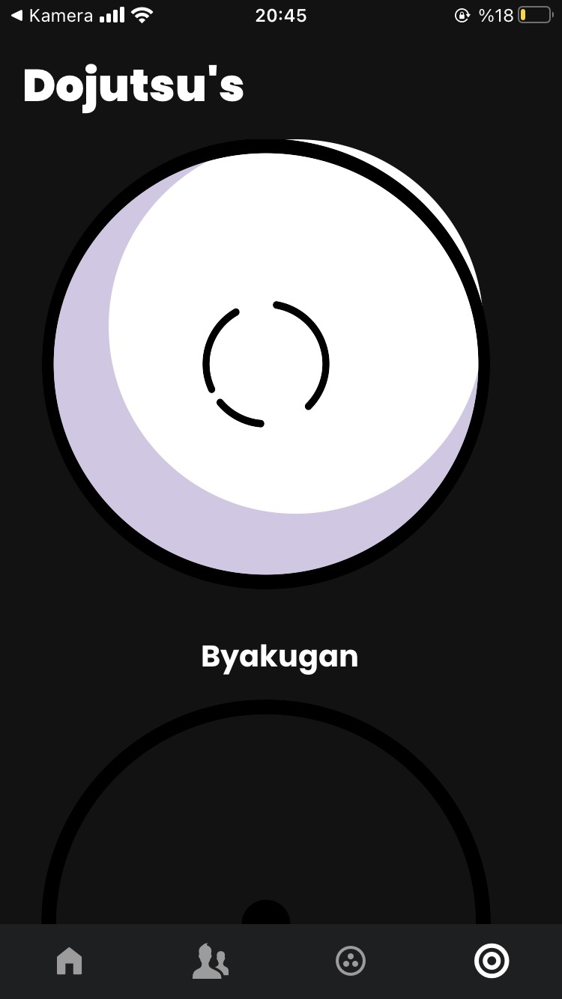
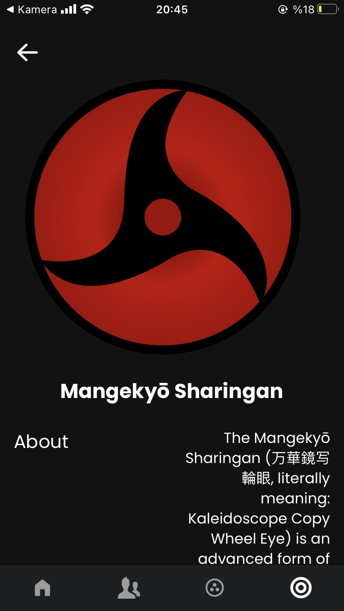
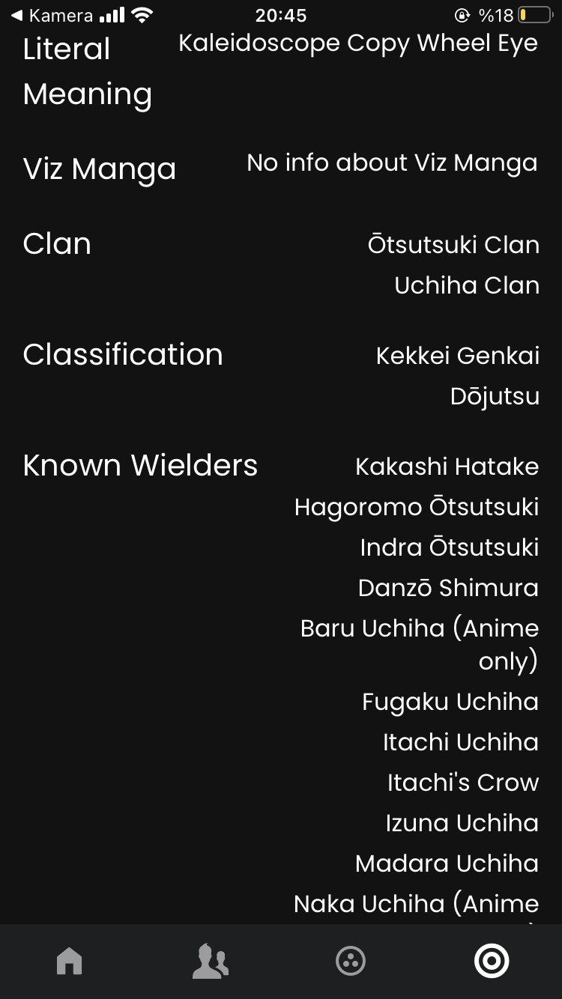

### MERN Stack Naruto Wiki App

Naruto Wiki App

### Used:

- **MongoDB** to store the data
- **Express** and **NodeJS** for building the api
- **React Native Expo** for the front-end
- **API**: https://mern-api-nrt.herokuapp.com/ (endpoints on my api's repo)
- **Cheerio** js lib for web-scraping

### Screenshots:

<table>
  <tr>
    <td>Home Screen</td>
     <td>Characters Screen</td>
     <td>Character Detail Screen</td>
  </tr>
  
  <tr>
    <td></td>
    <td></td>
    <td></td>
  </tr>
 </table>

<table>
  <tr>
    <td>Clan Screen</td>
     <td>Clan Detail Screen</td>
     <td>Clan Detail Screen 2</td>
  </tr>
  
  <tr>
    <td></td>
    <td></td>
    <td></td>
  </tr>
 </table>
 
 <table>
  <tr>
    <td>Dojutsu's Screen</td>
     <td>Dojutsu Detail Screen</td>
     <td>Dojutsu Detail Screen 2</td>
  </tr>
  
  <tr>
    <td></td>
    <td></td>
    <td></td>
  </tr>
 </table>
